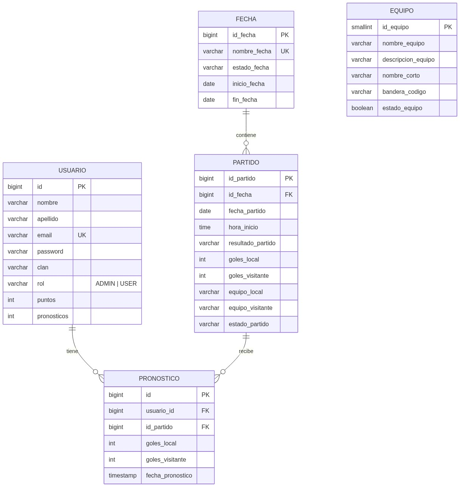
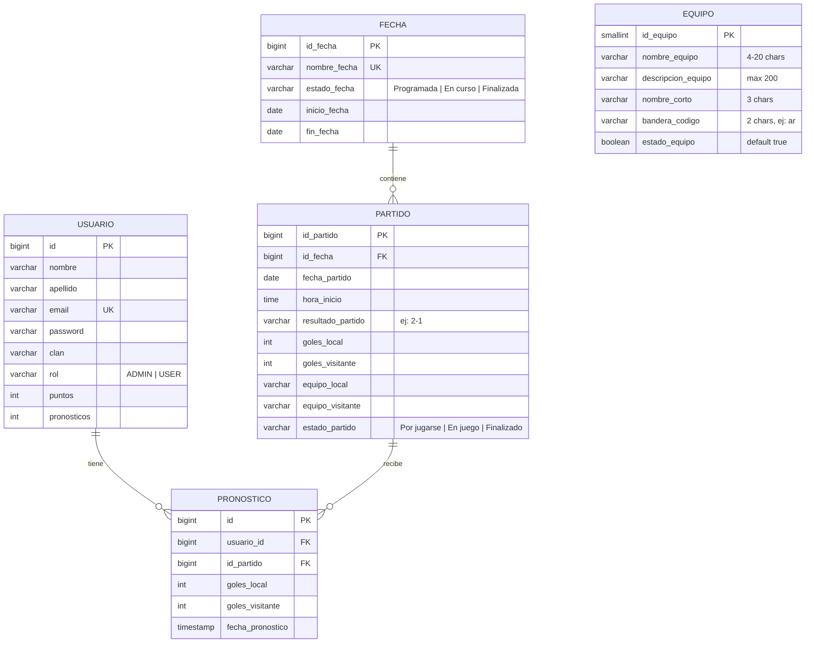

# ProdeGol — TPI Grupo 13

Sistema web de pronósticos deportivos para el Torneo de Programación 4 (PROG4). Permite registrar usuarios, crear equipos y fechas, cargar partidos, registrar pronósticos y calcular puntajes automáticamente.

Las credenciales reales no están en `application.properties` ni en archivos subidos a Git.

---

## Tecnologías

### Backend

| Tecnología | Versión |
|------------|---------|
| Java | 21 |
| Spring Boot | 3.5.14 |
| Spring Data JPA | — |
| Spring Security | — |
| JWT (jjwt) | 0.12.6 |
| PostgreSQL (Neon) | — |
| H2 (desarrollo) | — |
| Maven | — |
| Lombok | — |

### Frontend

| Tecnología | Versión |
|------------|---------|
| Angular | 21 (standalone) |
| Angular Router | — |
| HttpClient | — |
| FormsModule | — |

---

## Requisitos previos

- **Java 21** o superior
- **Node.js 20** o superior (para el frontend)
- **Maven** (incluido en `mvnw`)
- **PostgreSQL** en Neon (o usar H2 en local)

---

## Configuración y ejecución

### 1. Backend

#### Con H2 (recomendado para desarrollo local)

```bash
cd backend
.\mvnw spring-boot:run -Dspring-boot.run.profiles=h2
```

Esto levanta el backend en `http://localhost:8080` con una base H2 en memoria. No requiere configurar variables de entorno. La consola H2 está disponible en `http://localhost:8080/h2-console` (JDBC URL: `jdbc:h2:mem:prodegol`).

#### Con PostgreSQL (Neon)

Crear un archivo `.env` o usar `run.ps1` (no trackeado en git) con estas variables:

```bash
DATABASE_URL=jdbc:postgresql://<host>/<db>?sslmode=require
DATABASE_USERNAME=<username>
DATABASE_PASSWORD=<password>
JWT_SECRET_KEY=<base64-secret>
JWT_EXPIRATION=86400000
```

Luego ejecutar:

```bash
cd backend
.\mvnw spring-boot:run
```

### 2. Frontend

```bash
cd frontend
npm install
ng serve
```

El frontend se sirve en `http://localhost:4200`.

---

## Arquitectura

### Backend — Capas

```
Controller → Service (domain) → Repository → Entity (JPA)
                    ↕
                Mapper / DTO
```

- **Controllers**: Reciben requests HTTP y delegan a servicios. Validaciones básicas de formato.
- **Services**: Contienen la lógica de negocio. Separados en interfaces (`IPartidoCreateService`) e implementaciones concretas en `domain/`.
- **Repositories**: Spring Data JPA con `Specification` para filtros dinámicos.
- **Entities**: Modelos JPA mapeados a tablas PostgreSQL.
- **Mappers**: Convierten entre entidades y DTOs (estáticos o bean-style).
- **Security**: Filtro JWT + `SecurityConfig` con rutas públicas y protegidas.

### Frontend — Componentes standalone

```
Componente → Service (HttpClient) → Backend API
```

Cada componente es standalone (sin NgModule). El routing lazy-load resources según la ruta. El `auth.interceptor` agrega el token JWT a cada request y redirige a `/login` en 401.

---

## Esquema de base de datos





> Nota: `EQUIPO` no tiene FK a `PARTIDO`. Los equipos se referencian por nombre en los campos `equipo_local` y `equipo_visitante`.

---

## API REST — Endpoints

### Auth (`/api/auth`)

| Método | Ruta | Auth | Descripción |
|--------|------|------|-------------|
| POST | `/api/auth/register` | — | Registrar usuario |
| POST | `/api/auth/login` | — | Iniciar sesión, devuelve JWT |

### Equipos (`/equipo`)

| Método | Ruta | Auth | Descripción |
|--------|------|------|-------------|
| POST | `/equipo` | ✓ | Crear equipo (máx. 32) |
| GET | `/equipo` | ✓ | Listar equipos (filtros query opcionales) |
| GET | `/equipo/{id}` | ✓ | Obtener equipo por ID |
| DELETE | `/equipo/{id}` | ✓ | Eliminación lógica (estado = false) |

### Fechas (`/api/fechas`)

| Método | Ruta | Auth | Descripción |
|--------|------|------|-------------|
| POST | `/api/fechas` | ✓ | Crear fecha |
| GET | `/api/fechas` | ✓ | Listar fechas (`?orden=asc\|desc`) |
| PUT | `/api/fechas/{id}` | ✓ | Actualizar fecha |
| DELETE | `/api/fechas/{id}` | ✓ | Eliminar fecha (solo sin partidos activos) |

### Partidos (`/partidos`)

| Método | Ruta | Auth | Descripción |
|--------|------|------|-------------|
| POST | `/partidos` | ✓ | Crear partido |
| GET | `/partidos` | ✓ | Listar partidos (filtros query opcionales) |
| GET | `/partidos/fecha/{fechaId}` | ✓ | Listar por fecha |
| PATCH | `/partidos/{id}` | ✓ | Actualizar parcialmente |
| PUT | `/partidos/{id}/resultado` | ADMIN | Cargar resultado |
| PUT | `/partidos/{id}/finalizar` | ADMIN | Finalizar y calcular puntos |
| DELETE | `/partidos/{id}` | ✓ | Eliminar (solo sin pronósticos) |

### Pronósticos (`/api/pronosticos`)

| Método | Ruta | Auth | Descripción |
|--------|------|------|-------------|
| GET | `/api/pronosticos/proximos` | ✓ | Próximos partidos + pronóstico del usuario |
| GET | `/api/pronosticos/partido/{partidoId}` | ✓ | Pronóstico de un partido específico |
| GET | `/api/pronosticos/usuario/{usuarioId}` | ✓ | Todos los pronósticos de un usuario |
| PUT | `/api/pronosticos/partido/{partidoId}` | ✓ | Crear o actualizar pronóstico (upsert) |

### Ranking (`/api/ranking`)

| Método | Ruta | Auth | Descripción |
|--------|------|------|-------------|
| GET | `/api/ranking` | ✓ | Ranking general (`?orden=desc&clan=...`) |
| GET | `/api/ranking/clanes` | ✓ | Lista de clanes disponibles |
| GET | `/api/ranking/usuario/{id}` | ✓ | Perfil público con posición |

---

## Colección de Postman

El archivo [`docs/postman_collection.json`](docs/postman_collection.json) contiene todos los endpoints configurados con variables y scripts de autenticación.

### Cómo usarla

1. Abrir Postman → File → Import → seleccionar `postman_collection.json`
2. Crear un Environment nuevo:
   - `base_url`: `http://localhost:8080`
   - No hace falta crear `token`: el script de Login lo configura automáticamente
3. Ejecutar primero **Auth → Register** o **Auth → Login**
4. Usar las variables `{{fecha_id}}`, `{{partido_id}}`, `{{equipo_id}}` seteándolas manualmente con los IDs devueltos por las respuestas

### Flujo típico de prueba

```
Register → Login → Crear Equipo → Crear Fecha → Crear Partido
→ Cargar Resultado → Finalizar Partido → Ver Ranking
```

---

## Reglas de negocio

### Pronósticos

- Se pueden crear/modificar hasta **30 minutos antes** del horario del partido (comparado contra las 20:00 por defecto si no se especifica hora).
- Se usa **upsert**: un mismo usuario no puede tener dos pronósticos para el mismo partido.

### Puntaje

| Condición | Puntos |
|-----------|--------|
| Resultado exacto (goles exactos) | 3 |
| Acierto de tendencia (ganador/empate, goles incorrectos) | 1 |
| Otro | 0 |

El cálculo se activa automáticamente al finalizar un partido.

### Equipos

- Máximo **32 equipos activos** simultáneamente.
- Solo se cuentan equipos con `estado_equipo = true`.
- El campo `bandera_codigo` usa códigos ISO 3166-1 alpha-2 (ej: `ar`, `br`, `es`) y se renderiza desde `https://flagcdn.com`.

### Fechas

- `finFecha` debe ser mayor o igual a `inicioFecha`.
- Una fecha solo se puede eliminar si no tiene partidos o todos están finalizados.
- El estado de la fecha se actualiza automáticamente según los partidos que contiene.

### Partidos

- Al crear un partido se valida que la fecha del partido esté dentro del rango de la fecha (jornada).
- `fechaPartido` debe ser posterior a la fecha actual al momento de creación.
- No se puede crear un partido duplicado (mismos equipos en la misma fecha, independientemente del orden local/visitante).
- Solo se puede eliminar un partido si no tiene pronósticos asociados.
- El resultado solo se puede cargar si el partido está en estado "En juego".
- Al finalizar se calculan puntos y se actualiza el estado de la fecha.

### Seguridad

- Las contraseñas se almacenan con BCrypt.
- Las contraseñas deben tener al menos 8 caracteres, una mayúscula y un número.
- Los endpoints de resultado y finalización requieren rol `ADMIN`.
- El token JWT expira según la configuración (default: 24h).

---

## Estructura del proyecto

```
TPI-GRUPO13/
├── README.md
├── docs/
│   ├── diagrama-bd.png
│   └── postman_collection.json
├── backend/
│   ├── mvnw
│   ├── run.ps1              # Script local con credenciales (gitignored)
│   ├── pom.xml
│   └── src/
│       └── main/
│           ├── java/com/example/TPI/PROG4/
│           │   ├── Application.java
│           │   ├── configs/           # BaseResponse, exceptions
│           │   ├── controllers/       # REST controllers
│           │   ├── dtos/              # Request/Response DTOs
│           │   ├── exceptions/        # GlobalExceptionHandler
│           │   ├── Interfaces/        # Service interfaces
│           │   ├── mappers/           # Entity ↔ DTO mappers
│           │   ├── models/            # JPA entities
│           │   ├── repositories/      # Spring Data JPA + specs
│           │   ├── security/          # JWT + Spring Security
│           │   └── services/          # Business logic
│           └── resources/
│               ├── application.properties
│               ├── application-h2.properties
│               └── ...
├── frontend/
│   ├── package.json
│   ├── angular.json
│   └── src/
│       ├── app/
│       │   ├── auth.service.ts
│       │   ├── app.routes.ts
│       │   ├── app.config.ts
│       │   ├── auth.interceptor.ts
│       │   ├── auth.guard.ts
│       │   ├── admin.guard.ts
│       │   ├── components/
│       │   │   ├── auth/             # LoginComponent
│       │   │   ├── register/         # RegisterComponent
│       │   │   ├── home/             # HomeComponent
│       │   │   ├── perfil/           # PerfilComponent
│       │   │   ├── fechas.component/ # FechasComponent (admin)
│       │   │   ├── partidos.component/ # PartidosComponent (admin)
│       │   │   ├── partidos-cliente/ # PartidosCliente (público)
│       │   │   └── home-admin/       # HomeAdmin
│       │   ├── equipos/              # EquiposComponent
│       │   └── services/             # PartidoService, FechaService
│       ├── environments/
│       │   └── environment.ts
│       └── styles.css
```

---

## Consideraciones técnicas

- **ddl-auto=update**: Hibernate crea/actualiza las tablas automáticamente. No requiere scripts SQL manuales.
- **Pronósticos**: La tabla tiene una columna `partido_id` legacy que debe eliminarse manualmente si aparece: `ALTER TABLE pronosticos DROP COLUMN partido_id;`
- **CORS**: El backend permite origen `http://localhost:4200`.
- **Frontend**: Usa el nuevo builder de Angular (application builder) en lugar del tradicional. Los componentes son standalone con `@if`/`@for`.
- **Banderas**: Las imágenes de banderas se sirven desde `https://flagcdn.com` usando el código de país de 2 letras.
